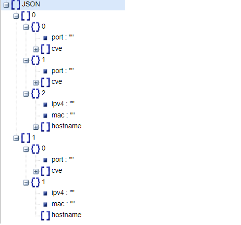
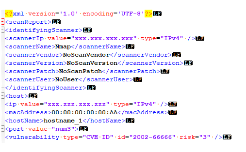
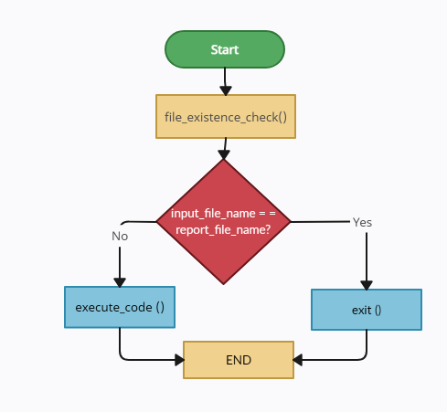

  
[](www.linkedin.com/in/veronica-makalovich-cybersec)

# Report-formatter-from-Nmap-to-QRadar

*This project represents Nmap report in a readable format for QRadar.*   

## Overview  
**Problem:** VA scanners Nmap, presented in QRadar, do not add CVE's to assets.  
**Solution:** Use Axis VA scanner.  
**Goal:** Create .xml report, add vulnerabilities for each IP source with additional information: ports, hosts and MAC address.  

**Programming language:** Python  
**Requirements:** None

## Project Descriprion
The target machine is running Windows Server 20XX. This operating system does not support virtualization tools (required for running bash) or containerization tools (required for Docker or similar tools). 
It was decided to develop a Python script and run it using Task Scheduler.  
**Python needs to be installed on the target machine.**

## Project Structure
The project consists of 3 directories and a script. 

- **[Data](https://github.com/MvVeronica/Report-formatter-from-Nmap-to-QRadar/tree/main/Data)** : This directory is used to store Nmap reports in .xml format. It serves as the input data folder for the project.  
- **[Project_templates](https://github.com/MvVeronica/Report-formatter-from-Nmap-to-QRadar/tree/main/Project_templates)** : This directory contains project templates (currently only one). The structure of the .xml report file for QRadar is based on this template.

  > [Template.xml](https://github.com/MvVeronica/Report-formatter-from-Nmap-to-QRadar/blob/main/Project_templates/Template.xml) structure was discovered with testing instruments, any changes to this structure require additional import tests into QRadar.  

- **[Reports](https://github.com/MvVeronica/Report-formatter-from-Nmap-to-QRadar/tree/main/Reports)** : This directory is where the script places the ready-to-import reports for QRadar. The reports are not deleted over time (administrator request) and are simply stored there.


## Project Logic
The Python script uses Nmap scan reports in .xml format as input data. The main working library for working with .xml  [xml.etree.ElementTree](https://docs.python.org/3/library/xml.etree.elementtree.html)  

The working tag(simplified version), from which code gets data(Nmap report), is presented below.

### Input data Processing

```xml
	<host/>
		<address addr="zzz.zzz.zzz.zzz" addrtype="ipv4"/>
		<address addr="00:00:00:00:00:AA" addrtype="mac" vendor=""/>

		<hostnames>
			<hostname name="hostname_1" type="PTR"/>
			<hostname name="hostname_2" type="PTR"/>
		</hostnames>

		<ports>
		<port  portid="num1"/>
            <table>
                <table key="CVE-200-000">
                    <elem key="title">attack</elem>
                    <elem key="state">LIKELY VULNERABLE</elem>
                </table>

                <table key="dates">
                    <table key="disclosure">
                        <elem key="year">200</elem>
                        <elem key="day">00</elem>
                        <elem key="month">01</elem>
                    </table>
                </table>
            </table>
		</port>

        <port  portid="num2"/>
            <table>
                <table key="CVE-300-000">
                    <elem key="title">attack</elem>
                    <elem key="state">LIKELY VULNERABLE</elem>
                </table>
            </table>
		</port>

```

It is important to note that the report structure presented in the Data directory is just an example and may vary slightly depending on the data: it may or may not have hostnames, it may have any number of ports and CVEs.

***Attention! Vulnerabilities may also include other groups. However, at the request of the administrator, only CVE group has been highlighted***

By getting data from the input file (<span style="color:#FD8D14">functions get_cve_by_ports()</span> and <span style="color:#FD8D14">get_hostdata()</span>), a list is formed with the following structure (<span style="color:#FD8D14">function input_data()</span>):

<center>
    
</center>

### Creating QRadar report template

Based on the number of hosts in the input data and the original template Template.xml (Template directory), a template for the future report is created (<span style="color:#FD8D14">function dd_hosts_to_report_template()</span>):

```xml
<scanReport>
    <identifyingScanner>
        <scannerIp value="xxx.xxx.xxx.xxx" type="IPv4" />
        <scannerName>Nmap</scannerName>
        <scannerVendor>NoScanVendor</scannerVendor>
        <scannerVersion>NoScanVersion</scannerVersion>
        <scannerPatch>NoScanPatch</scannerPatch>
        <scannerUser>NoUser</scannerUser>
    </identifyingScanner>
    <host>
        <ip value="ip" type="IPv4" />
        <macAddress>mac</macAddress>
        <hostName>host</hostName>
        <port value="port">
            <vulnerability type="CVE ID" id="id" risk="3" />
        </port>
    </host>
    <host>
        <ip value="ip" type="IPv4" />
        <macAddress>mac</macAddress>
        <hostName>host</hostName>
        <port value="port">
            <vulnerability type="CVE ID" id="id" risk="3" />
        </port>
    </host>
</scanReport>
```

Then, the template is filled with input data and saved in the Reports directory with the same name as the original Nmap report.

### <p style="color:#C51605">NEW PROBLEM</p>  

During the report import testing, it was found that reports with control characters <span style="color:#FFE17B">**CR LF**</span> at the end of lines are not recognized and QRadar generates a "Runtime error: Scan module was asked to stop - results may be incomplete".

#### <p style="color:#CECE5A">SOLUTION</p>
Replace control characters at the end of lines with **LF**.

<center>
    
</center>

### Working with files
The project is based on clear file separation, which allows the security administrator to both work with Nmap reports and view reports for QRadar if necessary.

The Python script reads all existing files in the Data and Reports directories and compares their names. If a file with a similar name already exists, the code execution is terminated. If not, the code generates a report.

<center>
    
</center> 

## Usage
Before code usage:
- Git clone

Using test data:
- Delete the [Data-in.xml](https://github.com/MvVeronica/Report-formatter-from-Nmap-to-QRadar/blob/main/Data/Data-in.xml) file from the [Reports](https://github.com/MvVeronica/Report-formatter-from-Nmap-to-QRadar/tree/main/Reports) directory.
- Run the script in Visual Studio Code.
- Check the [Reports](https://github.com/MvVeronica/Report-formatter-from-Nmap-to-QRadar/tree/main/Reports) directory. 😉

Using product data:
- Add the Nmap report in .xml format to the [Data](https://github.com/MvVeronica/Report-formatter-from-Nmap-to-QRadar/tree/main/Data) directory.
- Run the script in Visual Studio Code.
- Check the [Reports](https://github.com/MvVeronica/Report-formatter-from-Nmap-to-QRadar/tree/main/Reports) directory, your report will appear there. 😉

## License  
MIT: https://rem.mit-license.org

